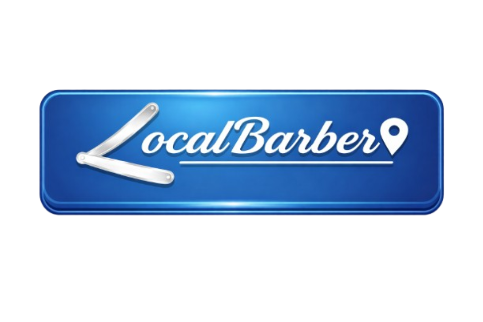

# LocalBarber



Plataforma web de gestão para barbearias que centraliza agendamentos, clientes, serviços, equipe e controle financeiro em um painel responsivo.

## Sobre o projeto

O LocalBarber é um projeto de TCC criado para ajudar barbearias pequenas e médias a organizar a operação diária em um único sistema. A proposta é substituir controles espalhados em agendas, mensagens e planilhas por uma experiência simples, visual e adequada à rotina do estabelecimento.

O sistema reúne uma página institucional, cadastro de empresas, autenticação de usuários e um painel administrativo com módulos de agenda, clientes, serviços, equipe, faturamento, transações e configurações da barbearia.

## Funcionalidades

- página inicial responsiva com apresentação da plataforma;
- cadastro de barbearia, endereço e usuário administrador;
- login com sessão PHP e senha protegida por hash;
- dashboard com resumo operacional;
- agenda semanal de atendimentos;
- cadastro e consulta de clientes;
- gestão de serviços, preços, duração e comissões;
- organização da equipe de profissionais;
- acompanhamento de faturamento e transações;
- configuração dos dados, horários e redes sociais da barbearia;
- tema claro/escuro e paleta de comandos para navegação rápida;
- central de informações com apresentação, FAQ, contato, termos e privacidade.

## Estado atual

O projeto está em fase de protótipo funcional para o TCC.

| Área | Situação atual |
| --- | --- |
| Interface e navegação | Implementadas em HTML, CSS e JavaScript |
| Responsividade e temas | Implementados |
| Cadastro de empresa | Integrado ao PostgreSQL por PHP/PDO |
| Login, sessão e logout | Implementados em PHP |
| Schema do banco | Disponível para PostgreSQL/Supabase |
| Agenda, clientes, serviços e financeiro | Interfaces interativas com dados demonstrativos no navegador |
| Persistência completa dos módulos | Próxima etapa de desenvolvimento |

## Tecnologias

- HTML5;
- CSS3 responsivo;
- JavaScript;
- PHP 8.2;
- PDO para PostgreSQL;
- PostgreSQL hospedado no Supabase;
- Apache pelo XAMPP;
- Google Charts no módulo financeiro;
- ViaCEP para consulta de endereço;
- Google Fonts.

## Estrutura do projeto

```text
LocalBarber/
|-- .env.example              # Modelo público das variáveis de ambiente
|-- .gitignore                # Impede o envio de credenciais locais
|-- .htaccess                 # Protege arquivos ocultos no Apache
|-- auth/                     # Login e encerramento de sessão
|-- config/                   # Carregamento do .env e conexão PDO
|-- css/                      # Estilos de cada tela e responsividade global
|-- database/                 # Criação e reparo do schema do banco
|-- js/                       # Tema e paleta de comandos
|-- agenda.html               # Agenda de atendimentos
|-- cadastro-empresa.php      # Cadastro da barbearia e do administrador
|-- central-informacoes.html  # Sobre, contato, termos, privacidade e FAQ
|-- clientes.html             # Gestão de clientes
|-- dashboard.php             # Dashboard protegido por sessão
|-- equipe.html               # Gestão da equipe
|-- faturamento.html          # Indicadores financeiros
|-- minha-barbearia.html      # Configurações do estabelecimento
|-- pagina-inicial.html       # Página inicial e acesso ao login
|-- servicos.html             # Gestão de serviços
`-- transacoes.html           # Histórico financeiro
```

## Requisitos

- XAMPP com Apache e PHP 8.2 ou superior;
- extensões PHP `PDO` e `pdo_pgsql` habilitadas;
- projeto PostgreSQL no Supabase;
- navegador moderno;
- conexão com a internet para Supabase, Google Fonts, Google Charts e ViaCEP.

## Configuração do ambiente

### 1. Localize o projeto no XAMPP

O diretório atual do projeto é:

```text
C:\xampp\htdocs\LocalBarber
```

### 2. Habilite o driver PostgreSQL do PHP

No arquivo `C:\xampp\php\php.ini`, habilite as extensões abaixo removendo o ponto e vírgula do início das linhas:

```ini
extension=pdo_pgsql
extension=pgsql
```

Reinicie o Apache depois da alteração. Confirme pelo terminal:

```powershell
C:\xampp\php\php.exe -m | Select-String "PDO|pgsql"
```

### 3. Prepare o banco de dados

No SQL Editor do Supabase, execute:

```text
database/001_create_localbarber_schema.sql
```

Se o schema já existir e precisar de correção, execute em seguida:

```text
database/002_repair_localbarber_schema.sql
```

Mais detalhes estão em [`database/README.md`](database/README.md).

### 4. Configure a conexão

Crie o arquivo local `.env` a partir do modelo público:

```powershell
Copy-Item .env.example .env
```

Preencha o novo `.env` com os dados exibidos na seção de conexão do seu projeto Supabase. O arquivo `config/database.php` lê as seguintes variáveis:

| Variável | Finalidade |
| --- | --- |
| `SUPABASE_DB_HOST` | Host direto ou Session Pooler do Supabase |
| `SUPABASE_DB_PORT` | Porta do PostgreSQL, normalmente `5432` |
| `SUPABASE_DB_NAME` | Nome do banco, normalmente `postgres` |
| `SUPABASE_DB_USER` | Usuário do banco |
| `SUPABASE_DB_PASSWORD` | Senha do banco |
| `SUPABASE_DB_SCHEMA` | Schema da aplicação, atualmente `locaalbarber` |

Use o Session Pooler quando a rede local não oferecer suporte a IPv6.

> O `.env` contém credenciais reais e está bloqueado pelo `.gitignore`. Publique somente o `.env.example`, que contém valores de exemplo.

### 5. Execute o sistema

Com o Apache iniciado, acesse:

```text
http://localhost:8080/LocalBarber/
```

Neste computador, o Apache do XAMPP está configurado na porta `8080`. Em outra instalação, a URL pode ser `http://localhost/LocalBarber/`.

## Fluxo principal

1. A barbearia cria a conta em `cadastro-empresa.php`.
2. O PHP grava a empresa, o endereço e o administrador em uma única transação.
3. O usuário entra pelo modal da página inicial.
4. O backend valida a senha, cria a sessão e redireciona para `dashboard.php`.
5. O dashboard protegido apresenta os módulos de gestão.

## Próximas etapas recomendadas

- conectar agenda, clientes, serviços, equipe e financeiro ao banco;
- substituir os dados demonstrativos das telas por consultas e APIs PHP;
- adicionar validação e proteção CSRF aos formulários;
- criar testes automatizados para cadastro, login e regras financeiras;
- padronizar os títulos e metadados de todas as páginas;
- preparar uma estratégia de deploy para ambiente de produção.

## Documentação complementar

A descrição acadêmica e os textos curtos de apresentação estão em [`DESCRICAO_DO_PROJETO.md`](DESCRICAO_DO_PROJETO.md).
